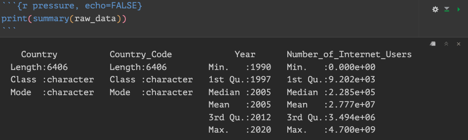

```{r setup, include=FALSE}
# Setting up Global Instructions:
knitr::opts_chunk$set(echo = TRUE, include = TRUE, message = FALSE, warning = FALSE)
options(scipen = 999, digits = 10)
```


#### Section 1: Loading the libraries
```{r Loading the libraries}
# Loading the libraries
library(dplyr)
library(tidyr)
library(knitr)
library(kableExtra)
library(ggplot2)
library(scales)
library(RColorBrewer)
library(viridis)
library(htmltools)

```


#### Section 2: Research Question

Given that technological advancements are often first adopted in developed countries with the necessary resources and infrastructure, this is not typically the case for Latin American countries. What has been the growth in internet usage among people in Latin America from 1990 to the present, and how does it compare to that of a first-world country?

#### Data set introduction:


The data set extracted form [Our World in Data](https://ourworldindata.org/internet) (For the citation, please see the last part of this work).
This is an organisation that focuses on making research and data on major global issues like poverty, disease, hunger, climate change, war, existential risks, and inequality accessible and understandable to promote progress.

On this short data set, the variables contained are the following:

```{r reading the data}
raw_data <- read.csv("number-of-internet-users.csv",header = TRUE)
```

```{r Arranging the names for presentation, echo=TRUE, include=FALSE}
raw_data <- raw_data %>%
        rename(Country = Entity,
               Country_Code = Code,
               Number_of_Internet_Users = Number.of.Internet.users)

```

```{r}
# Creating a new table with the count of distinct countries
countries_count <- raw_data %>%
  summarise(Count = n_distinct(Country)) %>%
  mutate(Countries = "Number of Countries") %>%
  select(Countries, Count)
```


**Variables:**

The following are the variables contained in the Data Set:
```{r Display Variables}
# Displaying the variables:

print(colnames(raw_data))
```


* **Country:** 
Refers to the 224 distinct Countries contained in the original Data Set.
```{r counting the distinc countries}

# Creating a new table with the count of distinct countries
new_table <- raw_data %>%
  summarise(Count = n_distinct(Country)) %>%
  mutate(Row = "Number of Countries") %>%
  select(Row, Count)

# Displaying the table
kable(new_table, col.names = c("Description", "Count"), caption = "Summary of Data")

```


* **Country_Code:** 

Refers to the specific code allocated for each country

* **Year:** 

Refers to the Years contained.This data contained year 1990 to 2020

```{r Min and Max Years}
# Calculate the minimum and maximum years
min_year <- min(raw_data$Year, na.rm = TRUE)
max_year <- max(raw_data$Year, na.rm = TRUE)

# Create a data frame with these values
min_max_years <- data.frame(
  `Min and Max Years` = c("Minimum Year", "Maximum Year"),
  Year = c(min_year, max_year)
)

# Display the data frame:
kable(min_max_years, col.names = c("Description", "Year"), caption = "Minimum and Maximum Years") %>%
  kable_styling(position = "center")
```

* **Number_of_Internet_Users:** 

Refers to the number of people using (having access) to internet for each year according to the statistics in the data set.


### Section 4: Data set description

The dataset raw_data provides insights into internet usage across different countries. It comprises 6,406 entries, with each entry detailing a specific country, its corresponding code, the year, and the number of internet users. The dataset spans from 1990 to 2020. The number of internet users ranges widely, from 0 to an astounding 4.7 billion, reflecting the exponential growth of internet adoption over the years. The median year in the dataset is 2005, with key statistical quartiles at 1997 and 2012, highlighting significant periods in the dataset's timeline.


```{r Inserting summary Image, pressure, echo=FALSE, fig.align='center'}

```

**Data types:**

The Raw data contains the following formats:

```{r data formats, fig.align='center'}
str(raw_data)

```


### Section 5: Data summary


In order to resolve the question, I will group the Latin American Countries, and the Northern ones. Subsequently, I will take the mean for each year between these 2 groups and I will compare by year. This will provide an general glimpse on the difference in growth and behavior throughout these time.

```{r Grouping Latin American Countries}
# List of Latin American Countries:

latin_american_countries <- c("Argentina","Belize","Bolivia",
                              "Brazil","Chile","Colombia","Costa Rica", 
                              "Cuba", "Dominican Republic", "Ecuador", 
                              "El Salvador","Guatemala","Haiti", "Honduras", 
                              "Jamaica", "Mexico", "Nicaragua","Panama", "Paraguay",
                              "Peru","Puerto Rico", "Suriname", "Trinidad and Tobago",
                              "Uruguay", "Venezuela")

# Filter the data to include only Latin American countries
Latin_America <- raw_data %>%
  filter(Country %in% latin_american_countries)

```


```{r Looking at the Latin America behaviour, echo=TRUE, fig.width=10}
# Defining my own color palette

custom_palette <- c("aquamarine", "darkgoldenrod4", "navyblue", "darkorchid2", "blue",
                    "blueviolet", "brown", "burlywood", "cadetblue", "chartreuse",
                    "chocolate", "coral", "cornflowerblue", "cyan", "darkgoldenrod",
                    "darkgreen", "darkkhaki", "darkmagenta", "darkorange", "darkred",
                    "deepskyblue", "dodgerblue", "firebrick", "forestgreen", "gold")

# Plotting the individual data:
Latino_ind_stats <- ggplot(Latin_America, aes(x = Year, y = Number_of_Internet_Users, color = Country)) +
  geom_line() +
  scale_color_manual(values = custom_palette) +
  labs(title = "Number of Internet Users per Year in Latin American Countries",
       x = "Year",
       y = "Number of Internet Users",
       color = "Country") +
    scale_y_continuous(labels = comma) +
  theme_minimal()

# Display the plot
print(Latino_ind_stats)

```

As expected, the growth is exponential. Nonetheless, it is very interesting to see how Brazil is the country with the biggest pivot upwards from starting from the year 2000.
Followed by Mexico, which is the second country with the highest amount of users on the Internet. The rest of the Latin American countries tend to behave in the same way.

As previously mentioned, in order to perform a general analysis as a group, I will use the mean of users per year for the group.


Now let's see the behavior of the Northern American Countries (USA and Canada for this work).

```{r Grouping USA and Canada Data, fig.align='center'}
# Grouping USA and Canada for the North American Countries

usa_and_canada <- raw_data %>% 
  filter(Country %in% c("United States", "Canada")) 


# Visualizing the behavior per year 

USA_n_Canda_PYPLOT <- 
  ggplot(usa_and_canada, aes(x = Year, y = Number_of_Internet_Users, color = Country)) +
  geom_line() +
  labs(title = "Number of Internet Users per Year USA vs Canada",
       x = "Year",
       y = "Number of Internet Users",
       color = "Country") +
  scale_color_manual(values = c("United States" = "blue", "Canada" = "red")) +
  scale_y_continuous(labels = comma) +
  theme_minimal()

print(USA_n_Canda_PYPLOT)

```


**Observations:**

The growth in Internet users in the USA is significantly higher than in Canada and many other countries, which makes Canada's adoption rate appear modest by comparison. Despite being a well-developed country, Canada's Internet user base is considerably smaller than that of the USA, which is surprising. Nevertheless, Canada is approaching 50 million Internet users, a figure comparable to that of Honduras in the Latin American group, where this number represents the median for the region.


```{r Grouping and Calculating Mean, echo=TRUE, fig.align='center', include=FALSE}

# Grouping the data for Latin America by year and calculate the mean, min, and max number of internet users per year

latin_america_stats_per_year <- Latin_America %>%
  group_by(Year) %>%
  summarise(
    Mean_Internet_Users = mean(Number_of_Internet_Users, na.rm = TRUE),
    Min_Internet_Users = min(Number_of_Internet_Users, na.rm = TRUE),
    Max_Internet_Users = max(Number_of_Internet_Users, na.rm = TRUE)
  )

# Format numbers with commas
latin_america_stats_per_year <- latin_america_stats_per_year %>%
  mutate(
    Mean_Internet_Users = formatC(Mean_Internet_Users, format = "f", big.mark = ",", digits = 0),
    Min_Internet_Users = formatC(Min_Internet_Users, format = "f", big.mark = ",", digits = 0),
    Max_Internet_Users = formatC(Max_Internet_Users, format = "f", big.mark = ",", digits = 0)
  )


# Creating a table for Latin America by using kable with a caption

LA_table <- kable(latin_america_stats_per_year, 
      col.names = c("Year", "Mean Internet Users", "Min Internet Users", "Max Internet Users"),
      caption = "Summary of Internet Users in Latin American Countries by Year",
      format = "html") %>%
  kable_styling(position = "center", full_width = FALSE, bootstrap_options = c("striped", "hover"))

#----------------------------------

# Grouping the data for USA and Canada by year and calculate the mean, min, and max number of internet users per year
us_canada_stats_per_year <- usa_and_canada %>%
  group_by(Year) %>%
  summarise(
    Mean_Internet_Users = mean(Number_of_Internet_Users, na.rm = TRUE),
    Min_Internet_Users = min(Number_of_Internet_Users, na.rm = TRUE),
    Max_Internet_Users = max(Number_of_Internet_Users, na.rm = TRUE)
  )

# Format numbers with commas
us_canada_stats_per_year <- us_canada_stats_per_year %>%
  mutate(
    Mean_Internet_Users = formatC(Mean_Internet_Users, format = "f", big.mark = ",", digits = 0),
    Min_Internet_Users = formatC(Min_Internet_Users, format = "f", big.mark = ",", digits = 0),
    Max_Internet_Users = formatC(Max_Internet_Users, format = "f", big.mark = ",", digits = 0)
  )

 # Creating the table using kable with a caption


USA_CA_table <-
kable(us_canada_stats_per_year, 
      col.names = c("Year", "Mean Internet Users", "Min Internet Users", "Max Internet Users"),
      caption = "Summary of Internet Users in United States and Canada by Year",
      format = "html") %>%
  kable_styling(position = "center", full_width = FALSE, bootstrap_options = c("striped", "hover"))


```


```{r}
# Display tables side by side
div(
  style = "display: flex; justify-content: space-between;",
  div(style = "width: 45%;", HTML(LA_table)),
  div(style = "width: 45%;", HTML(USA_CA_table))
)
```


**Observations:**

We can observe that comparatively, the growth in the amount of users in the Northern part of the American continent (Mainly driven by USA) is substantial, and despite being a vast country, it's growth never stopped (5 to 10 Million users more per year) with exception on the years 2012 to 2014 , where for some reason there was a decrease in the amount of users, whereas Latin America kept growing.


Visually, the growth between both groups will look like this:

```{r visualising growth on both groups, fig.align='center'}
# Joining both groups together in a single data set
# Selecting the columns Year and Mean_Internet_Users from both data frames
latin_america_selected <- latin_america_stats_per_year %>%
  select(Year, Mean_Internet_Users)

us_canada_selected <- us_canada_stats_per_year %>%
  select(Year, Mean_Internet_Users)

# Performing the join on the 'Year' column
LA_n_N <- latin_america_selected %>%
  left_join(us_canada_selected, by = "Year", suffix = c("_Latin_America", "_USA_CDA"))


# Renaming the columns for easier differentiation

LA_n_N <- LA_n_N %>% rename(
  Latin_America = Mean_Internet_Users_Latin_America,
  USA_CDA = Mean_Internet_Users_USA_CDA
)

# Passing to numeric in order to plot

LA_n_N <- LA_n_N %>%
  mutate(
    Latin_America = as.numeric(gsub(",","",Latin_America)),
    USA_CDA = as.numeric(gsub(",","",USA_CDA))
  )

# Creating the visualization:
  
LA_n_N_plot <- 
  ggplot(LA_n_N, aes(x = Year)) +
  geom_point(aes(y = Latin_America, color = 'Latin America')) +
  geom_point(aes(y = USA_CDA, color = 'USA and Canada')) +
  labs(title = "Mean of Internet Users per Year for the group",
       x = "Year",
       y = "Number of users",
       color = "Group/Region") +
  scale_y_continuous(labels = scales :: comma) +
  theme_minimal()

print(LA_n_N_plot)


```

* **Observations:**

1) _As expected, and complementing the information from the table, it is clear that not only the start but the growth in the number of users adopting the Internet to their lifes is significantly higher in the northern countries, where ; as mentioned at the beginning of this work; these countries have a vast variety of factors that allow and promote this kind of behavior and expansion._


2) _Looking a little in detail to the behavior year by year, if well the Latin American number of Internet users did not diminish during the years 2012 -2014 like the Northern counterpart, it well did slow down compared to previous year. It will interesting to compare the metrics with economic growth and compare if this could have had a relationship._


3) _Historical interesting fact is that in 1990, where there were 0 Internet adopters in Latin America, North America already had over a million people already navigating the web and working around it._


### Conclusions:

Conclusion
The journey of Internet adoption from 1990 to 2020 unveils a compelling narrative of digital divide and growth. In North America, led by the USA, the Internet saw explosive uptake right from the early 90s, with over a million users online in 1990 alone. This early adoption set the stage for continuous and significant growth, averaging millions of new users each year. By contrast, Latin America's digital story started more modestly. With virtually no users in 1990, the region's Internet usage began to pick up pace only later, reflecting broader socio-economic challenges and infrastructural gaps.

Despite being a well-developed country, Canada's Internet adoption, though substantial, paled in comparison to the USA, highlighting a curious lag within North America itself. Latin America's growth, though slower, was steady and relentless, marking an impressive rise from mere hundreds to millions of users. By 2020, the region approached 50 million users, showcasing resilience and gradual digital integration.

These patterns underscore the profound influence of economic capacity, infrastructure, and policy on technological adoption. North America's rapid and vast Internet growth stands as a testament to early investment and socio-economic readiness, while Latin America's story reflects a determined climb towards digital inclusion, setting the stage for future potential and growth.


### Citations:

* International Telecommunication Union (via World Bank); Gapminder (2019); UN (2022); HYDE (2017); Gapminder (Systema Globalis) – processed by Our World in Data. “Number of Internet users” [dataset]. International Telecommunication Union (via World Bank); Gapminder (2019); UN (2022); HYDE (2017); Gapminder (Systema Globalis) [original data].
